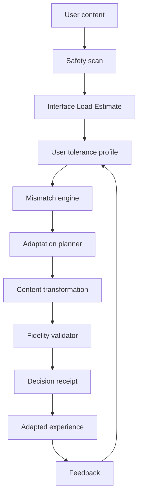
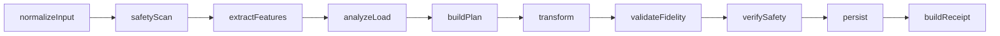

# Cognitive Load Firewall

**Your brain shouldn't have to fight the interface.**

Cognitive Load Firewall is an adaptive cognitive-accessibility platform that reshapes digital content around user-provided tolerance and accessibility preferences. It is especially relevant to concussion-recovery workflows, but it is **not** a diagnostic tool and does not provide medical clearance.

## Core idea

Most digital-health tools ask a recovering person to continually monitor themselves. Cognitive Load Firewall changes the adaptation target: **the interface changes instead**.



## Foundation included

- Next.js + TypeScript application shell
- Working `/demo` experience
- Deterministic Interface Load Estimate
- Load mismatch engine
- Adaptation planner
- Deterministic content-chunking fallback
- Emergency-like symptom safety rules
- Critical-token fidelity utilities
- PostgreSQL/Prisma schema
- Synthetic demo profiles
- Responsible AI page
- `/api/health` endpoint
- Render Blueprint starter config
- Unit tests
- Hackathon documentation

## Quick start

```bash
npm install
cp .env.example .env
npm run db:generate
npm run dev
```

For PostgreSQL:

```bash
npm run db:push
npm run db:seed
```

## Demo

Open `/demo`. The fictional Maya scenario executes content analysis, tolerance comparison, mismatch calculation, machine-readable adaptation planning, and deterministic fallback transformation without an external AI key.

## Safety boundary

The system must never diagnose concussion, calculate a recovery percentage, clear a person for sport/driving, or override clinician-provided constraints. Emergency-like symptom text should interrupt normal productivity/adaptation behavior.

## Data model

`User`, `CognitiveProfile`, `ContentArtifact`, `ContentAnalysis`, `Adaptation`, `AdaptationStage`, `AdaptationFeedback`, `SafetyEvent`, `ClinicianConstraint`, `AIExecution`, `AIReceipt`, `AccommodationCard`, and `UserConsent`.

## Render strategy

The current `render.yaml` provides the deployment foundation for the web app and PostgreSQL. The next build phase should add genuine **Render Workflows** orchestration for the multi-stage adaptation pipeline rather than using Render only as hosting.



## Next build priorities

1. persistence-backed end-to-end demo
2. real Render Workflows orchestration
3. AI provider abstraction + structured outputs
4. feedback-driven personalization
5. accessibility polish
6. accommodation card
7. end-to-end tests
8. production deployment

## License

MIT.
