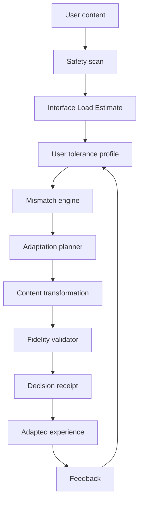
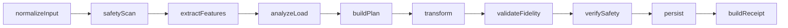

# Cognitive Load Firewall

**Your brain shouldn't have to fight the interface.**

Cognitive Load Firewall is an adaptive cognitive-accessibility platform that reshapes digital content around user-provided tolerance and accessibility preferences. It is especially relevant to concussion-recovery workflows, but it is **not** a diagnostic tool and does not provide medical clearance.

## Core idea

Most digital-health tools ask a recovering person to continually monitor themselves. Cognitive Load Firewall changes the adaptation target: **the interface changes instead**.



## What works today

- `/demo` with original, adapted, and difference views
- Deterministic Interface Load Estimate, mismatch, planning, safety, and fidelity
- Guest onboarding, local history, settings, and privacy-preserving accommodation card
- Recovery Session with optional browser read-aloud
- Responsible AI and interactive accessibility lab
- PostgreSQL/Prisma foundation and CI verification

## Quick start

```bash
npm install
cp .env.example .env
npm run db:generate
npm run dev
```

For PostgreSQL:

```bash
npm run db:push
npm run db:seed
```

## Demo

Open `/demo`. The fictional Maya scenario executes content analysis, tolerance comparison, mismatch calculation, machine-readable adaptation planning, and deterministic fallback transformation without an external AI key.

## Safety boundary

The system must never diagnose concussion, calculate a recovery percentage, clear a person for sport/driving, or override clinician-provided constraints. Emergency-like symptom text should interrupt normal productivity/adaptation behavior.

## Data model

`User`, `CognitiveProfile`, `ContentArtifact`, `ContentAnalysis`, `Adaptation`, `AdaptationStage`, `AdaptationFeedback`, `SafetyEvent`, `ClinicianConstraint`, `AIExecution`, `AIReceipt`, `AccommodationCard`, and `UserConsent`.

## Render strategy

The `render.yaml` provides the web app and PostgreSQL foundation. `lib/workflow/local.ts` implements the workflow contract used by the demo, returning workflow, request, and adaptation IDs with stage metadata. See [docs/RENDER_WORKFLOWS.md](docs/RENDER_WORKFLOWS.md).



## Honest limitations

The default provider is deterministic and runs without an API key. Prisma models and a reusable client are included for PostgreSQL deployment, while guest flows remain usable without a database. Render Workflows require deployment-specific binding; local workflow metadata is explicit and is not presented as a remote run. This product supports interface adaptation only and makes no clinical or recovery prediction.

## Verification

```bash
npm test
npm run typecheck
npm run build
```

The CI workflow runs those checks on pushes and pull requests.

## License

MIT.
